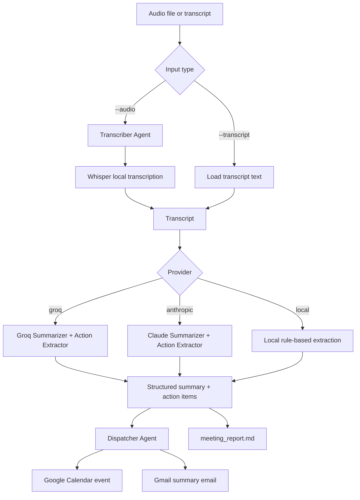

# Mako

Mako is a meeting-to-action automation pipeline.

Give it a meeting audio file or a transcript, and it turns the conversation into a useful follow-up package:

- a clean meeting summary
- action items with owners, due dates, and priority
- Google Calendar events for follow-up meetings
- a Gmail report sent to the chosen recipient
- a local `meeting_report.md` file you can keep or share

It started as a CLI project, but the goal is very real: take the messy output of a meeting and turn it into next steps automatically.

## Why This Exists

Meetings usually create work, but that work often gets lost in notes, chat messages, or memory. Mako tries to close that gap.

Instead of manually listening to a recording, writing a summary, finding tasks, creating a calendar event, and sending a follow-up email, you run one command:

```bash
python main.py --audio meeting.mp3 --email you@example.com --provider groq
```

Mako handles the pipeline from there.

## What Mako Can Do

- Accept an audio file: `.mp3`, `.wav`, or `.m4a`
- Accept a transcript file directly with `--transcript`
- Transcribe audio locally with Whisper
- Use Groq, Anthropic Claude, or local rules for summary/action extraction
- Save a Markdown report locally
- Send the report through Gmail
- Create Google Calendar events when follow-up meetings are mentioned
- Keep running even if Gmail or Calendar fails

## Architecture



## Pipeline Flow

Mako runs sequentially. Each stage depends on the previous one.

```text
Transcribe or load transcript
        ->
Summarize meeting
        ->
Extract action items
        ->
Dispatch to Calendar/Gmail
        ->
Save meeting_report.md
```

This is not a parallel agent swarm. It is a clean, step-by-step workflow where each agent has one job.

## Project Structure

```text
Mako/
|-- main.py
|-- orchestrator.py
|-- requirements.txt
|-- README.md
|-- agents/
|   |-- transcriber.py
|   |-- summarizer.py
|   |-- action_extractor.py
|   |-- groq_summarizer.py
|   |-- groq_action_extractor.py
|   |-- local_summarizer.py
|   |-- local_action_extractor.py
|   `-- dispatcher.py
`-- tools/
    |-- whisper_tool.py
    |-- calendar_tool.py
    |-- gmail_tool.py
    `-- google_auth.py
```

## Agents

### Transcriber

The transcriber takes an audio file and turns it into text using local Whisper.

This means no OpenAI API key is needed for transcription. Whisper runs on your machine.

### Summarizer

The summarizer reads the transcript and returns structured JSON:

```json
{
  "meeting_title": "Launch Plan Discussion",
  "attendees_mentioned": ["Priya", "Alex"],
  "key_decisions_made": ["Ship the beta checklist first"],
  "topics_discussed": ["Launch plan", "Onboarding bugs"],
  "follow_up_meetings": []
}
```

### Action Extractor

The action extractor finds tasks from the transcript and returns JSON:

```json
[
  {
    "task_description": "Prepare the beta checklist",
    "assigned_person": "Priya",
    "due_date": "2026-06-26",
    "priority": "Medium"
  }
]
```

### Dispatcher

The dispatcher handles the outside-world actions:

- creates Google Calendar events for follow-up meetings
- sends the meeting report through Gmail
- logs success or failure for each external call

Even if Gmail or Calendar fails, Mako still saves the local report.

## Providers

Mako supports three provider modes.

### Groq

Recommended for this project right now.

Groq gives much better extraction than local rules and is often easier to test without paid Anthropic credits.

```bash
python main.py --transcript transcript.txt --email you@example.com --provider groq
```

### Anthropic

This uses Claude through the Anthropic SDK.

It is high quality, but it needs Anthropic API credits.

```bash
python main.py --transcript transcript.txt --email you@example.com --provider anthropic
```

### Local

This uses simple local rules. It is fully free and does not call an LLM API.

It is useful for testing the pipeline, but it is less smart than Groq or Claude.

```bash
python main.py --transcript transcript.txt --email you@example.com --provider local
```

You can also use:

```bash
python main.py --transcript transcript.txt --email you@example.com --offline
```

`--offline` is just a shortcut for `--provider local`.

## Setup

Create and activate a virtual environment:

```bash
cd Mako
python -m venv .venv
.venv\Scripts\activate
```

Install dependencies:

```bash
pip install -r requirements.txt
```

If you added Groq after installing requirements earlier, install it directly:

```bash
pip install groq==1.5.0
```

## Environment Variables

Create a `.env` file in the `Mako` folder.

For Groq:

```text
GROQ_API_KEY=your_groq_api_key_here
GROQ_MODEL=llama-3.3-70b-versatile
```

For Anthropic:

```text
ANTHROPIC_API_KEY=your_anthropic_api_key_here
ANTHROPIC_MODEL=claude-sonnet-4-6
```

You only need the keys for the provider you plan to use.

## FFmpeg

Whisper needs FFmpeg to read audio files like `.mp3` and `.m4a`.

Check if it works:

```bash
ffmpeg -version
```

If Windows says `ffmpeg` is not recognized, install FFmpeg and make sure its `bin` folder is on your PATH.

## Google OAuth Setup

Mako uses Google OAuth for Gmail and Calendar.

In Google Cloud Console:

1. Create or select a project.
2. Enable Google Calendar API.
3. Enable Gmail API.
4. Configure the OAuth consent screen.
5. Add your Gmail account as a test user if the app is in testing mode.
6. Create an OAuth client ID.
7. Choose application type: Desktop app.
8. Download the JSON file.
9. Rename it to `credentials.json`.
10. Put it inside the `Mako` folder.

The app requests only these scopes:

```text
https://www.googleapis.com/auth/calendar.events
https://www.googleapis.com/auth/gmail.send
```

On the first run, Google opens a browser login. After you approve it, Mako saves `token.json` so you do not need to log in every time.

Do not share:

```text
.env
credentials.json
token.json
```

## Usage

### Run From A Transcript

```bash
python main.py --transcript transcript.txt --email you@example.com --provider groq
```

### Run From Audio

```bash
python main.py --audio meeting.mp3 --email you@example.com --provider groq
```

Supported audio formats:

```text
.mp3
.wav
.m4a
```

### Test Without Gmail Or Calendar

This is useful when you only want to test summary and action extraction.

```bash
python main.py --transcript transcript.txt --email you@example.com --provider groq --no-dispatch
```

### Fully Local Test

This avoids paid APIs and avoids Google dispatch.

```bash
python main.py --transcript transcript.txt --email you@example.com --provider local --no-dispatch
```

## Example Transcript

```text
Today Priya and Alex discussed the launch plan. Priya will prepare the beta checklist by Friday. Alex will review onboarding bugs next week. We decided to schedule a follow-up meeting on 2026-07-02 at 15:00 UTC.
```

## Example Output

Console output:

```text
[1/4] Transcribing or loading transcript...
[2/4] Summarizing meeting with Groq...
[3/4] Extracting action items with Groq...
[4/4] Dispatching calendar and email actions...
  - Calendar created: Launch Plan Follow-up
  - Email sent: you@example.com
Done. Saved report to meeting_report.md
```

Report output:

```text
meeting_report.md
```

The report includes:

- summary JSON
- action items table
- dispatch results
- full transcript

## Is This Fully Automated?

After setup, yes, it is an automated pipeline.

You still provide the input file and choose the recipient email, but the meeting processing itself is automated:

```text
audio/transcript -> summary -> actions -> calendar -> email -> report
```

The first Google run needs browser approval because OAuth requires your consent. After that, `token.json` lets future runs continue without repeating the login every time.


## Troubleshooting

### Anthropic says credit balance is too low

Use Groq instead:

```bash
python main.py --transcript transcript.txt --email you@example.com --provider groq
```

Or use local mode:

```bash
python main.py --transcript transcript.txt --email you@example.com --provider local
```

### Google says access denied

Your OAuth app is probably still in testing mode.

Add the Gmail account you are logging in with as a test user in the OAuth consent screen.

### Calendar event appears on the wrong date

Mako stores event details in `meeting_report.md`. Check the dispatch result there first.

The calendar tool now preserves UTC time correctly, so future events should show in your local calendar timezone as expected.

### FFmpeg is not recognized

FFmpeg is installed but not on PATH, or the terminal has not refreshed.

Close and reopen the terminal, then run:

```bash
ffmpeg -version
```

## Next Improvements

Useful upgrades for the future:

- FastAPI or Streamlit UI
- tests for JSON parsing and date handling
- report download page
- user confirmation before creating calendar events
- better handling for long meetings
- Docker setup
- sample demo video for portfolio

